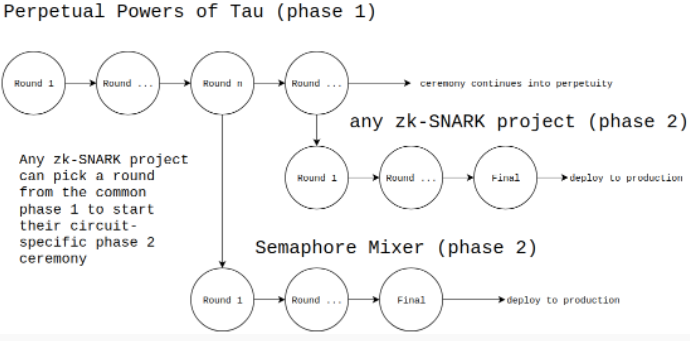

# FACTOR

## Prerequisite

- circom: [install](https://docs.circom.io/getting-started/installation/#installing-circom)
- snarkjs:

```
npm install -g snarkjs
```

## Commands

### To compile the circuit:

```
circom multiplier2.circom --r1cs --wasm --sym --c
```

With these options we generate three types of files:

- --r1cs: it generates the file multiplier2.r1cs that contains the R1CS constraint system of the circuit in binary format.
- --wasm: it generates the directory multiplier2_js that contains the Wasm code (multiplier2.wasm) and other files needed to generate the witness.
- --sym : it generates the file multiplier2.sym , a symbols file required for debugging or for printing the constraint system in an annotated mode.
- --c : it generates the directory multiplier2_cpp that contains several files (multiplier2.cpp, multiplier2.dat, and other common files for every compiled program like main.cpp, MakeFile, etc) needed to compile the C code to generate the witness.

### To compute the witness:

In our case, we want to prove that we are able to factor the number 33. So, we assign a = 3 and b = 11.

We need to create a file named input.json containing the inputs written in the standard json format.

```
{"a": 3, "b": 11}
```

Now, we calculate the witness and generate a binary file witness.wtns containing it in a format accepted by snarkjs.

```
node generate_witness.js multiplier2.wasm input.json witness.wtns
```

### To prove the circuit

After compiling the circuit and running the witness calculator with an appropriate input, we will have a file with extension .wtns that contains all the computed signals and, a file with extension .r1cs that contains the constraints describing the circuit. Both files will be used to create our proof.

Now, we will use the snarkjs tool to generate and validate a proof for our input. In particular, using the multiplier2, we will prove that we are able to provide the two factors of the number 33. That is, we will show that we know two integers a and b such that when we multiply them, it results in the number 33.

We are going to use the Groth16 zk-SNARK protocol. To use this protocol, you will need to generate a trusted setup. Groth16 requires a per circuit trusted setup. In more detail, the trusted setup consists of 2 parts:

- The powers of tau, which is independent of the circuit.
- The phase 2, which depends on the circuit.

#### Powers of Tau



Next, we provide a very basic ceremony for creating the trusted setup and we also provide the basic commands to create and verify Groth16 proofs.

First, we start a new "powers of tau" ceremony:

```
snarkjs powersoftau new bn128 12 pot12_0000.ptau -v
```

Then, we contribute to the ceremony:

```
snarkjs powersoftau contribute pot12_0000.ptau pot12_0001.ptau --name="First contribution" -v
```

#### Phase 2

The phase 2 is circuit-specific. Execute the following command to start the generation of this phase:

```
snarkjs powersoftau prepare phase2 pot12_0001.ptau pot12_final.ptau -v
```

Next, we generate a .zkey file that will contain the proving and verification keys together with all phase 2 contributions. Execute the following command to start a new zkey:

```
snarkjs groth16 setup multiplier2.r1cs pot12_final.ptau multiplier2_0000.zkey
```

Contribute to the new phase 2 of the ceremony:

```
snarkjs zkey contribute multiplier2_0000.zkey multiplier2_0001.zkey --name="1st Contributor Name" -v
```

Export the verification key:

```
snarkjs zkey export verificationkey multiplier2_0001.zkey verification_key.json
```

##### Generating a Proof

Once the witness is computed and the trusted setup is already executed, we can generate a zk-proof associated to the circuit and the witness:

```
snarkjs groth16 prove multiplier2_0001.zkey witness.wtns proof.json public.json
```

This command generates a Groth16 proof and outputs two files:

- proof.json: it contains the proof.
- public.json: it contains the values of the public inputs and outputs.

#### Verifying a Proof

To verify the proof, execute the following command:

```
snarkjs groth16 verify verification_key.json public.json proof.json
```

The command uses the files verification_key.json we exported earlier,proof.json and public.json to check if the proof is valid. If the proof is valid, the command outputs an OK.

A valid proof not only proves that we know a set of signals that satisfy the circuit, but also that the public inputs and outputs that we use match the ones described in the public.json file.

## Links

[Circom 2 Documentation](https://docs.circom.io/getting-started/proving-circuits/)
[Powers of Tau](https://medium.com/coinmonks/announcing-the-perpetual-powers-of-tau-ceremony-to-benefit-all-zk-snark-projects-c3da86af8377)